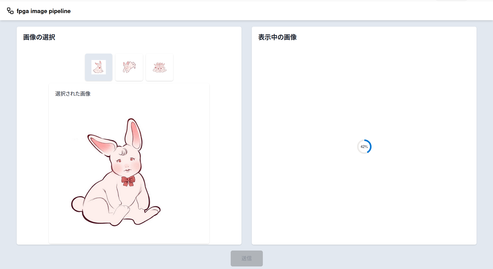
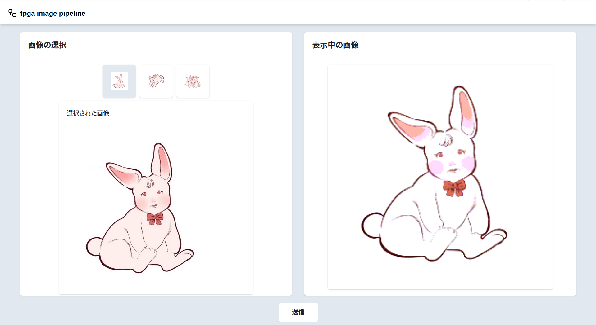
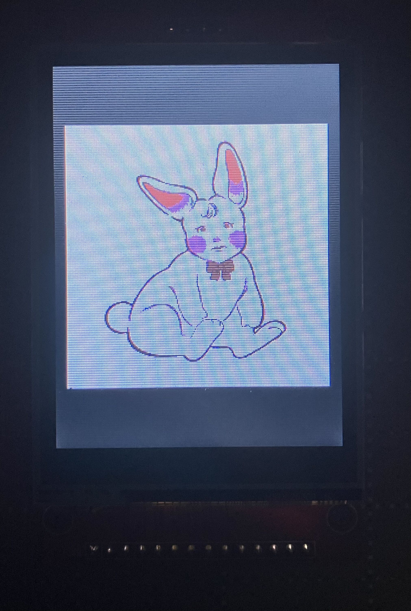
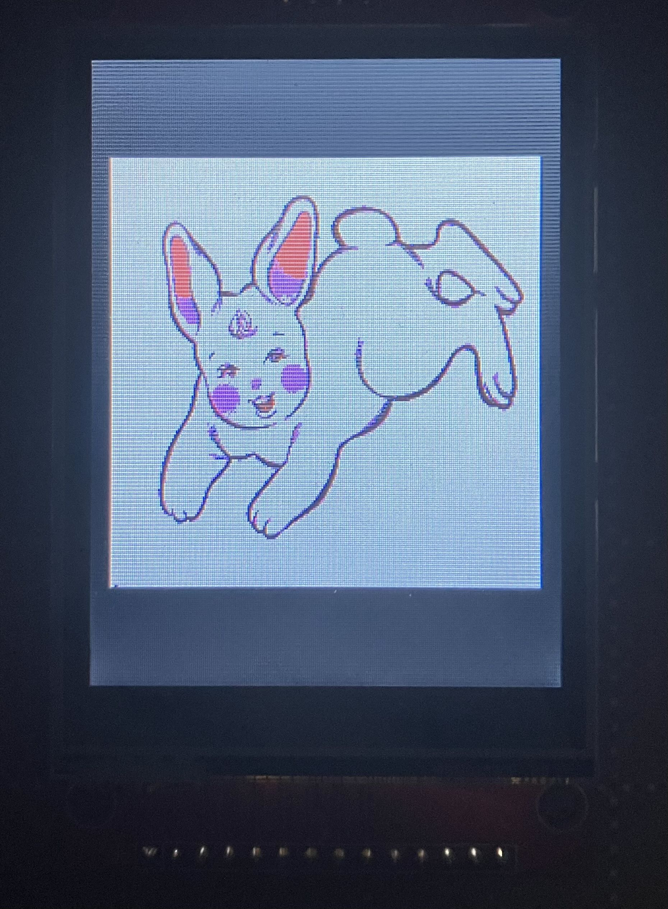
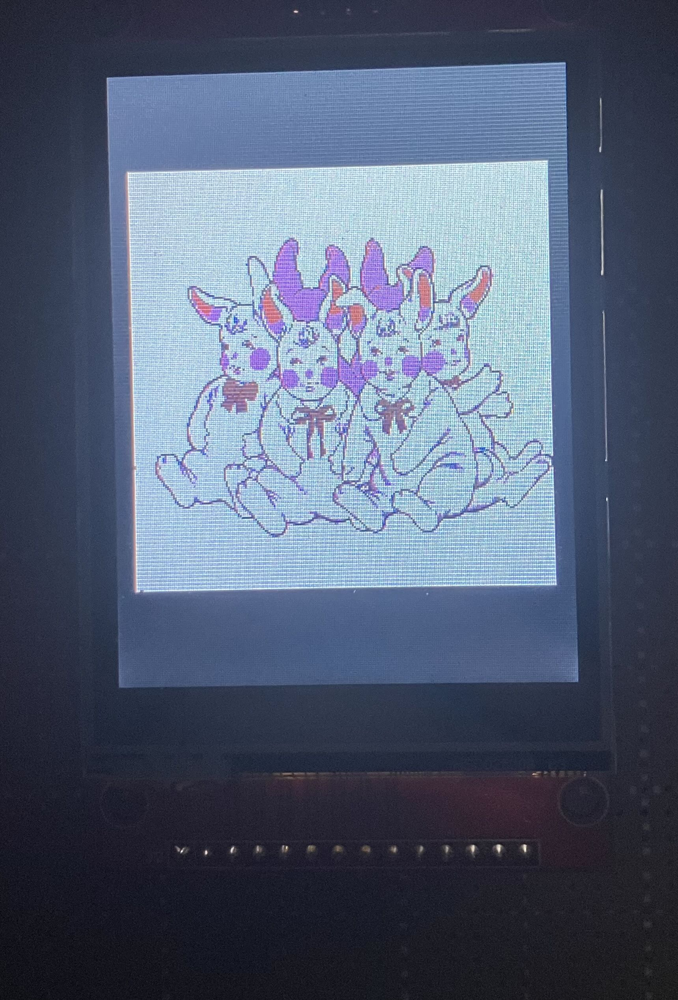

# fpga-image-pipeline
このプロジェクトは、FPGA上で「画像入力 → 前処理 → 描画/出力」までを一貫して行う画像処理パイプラインの実装です。現在は最小構成として「PC → Tang Nano 9k → LCD」の一連の流れを動作させるところまで実装しています。

LCDへの画像描画に関する基本的な流れは以下のリポジトリを参考にしてください。

・[BruCandy/fpga-spi-display](https://github.com/BruCandy/fpga-spi-display)

## 概要
本プロジェクトでは、以下の構成で画像データを扱います。
1. Webアプリケーション（React）

    ・ユーザーが画像を選択

2. バックエンド（C++）

    ・フロントエンドで指定された画像データを処理し、UART経由でFPGAに送信

3. FPGA（Tang Nano 9k）

    ・受信した画像データを処理

    ・SPI通信によりLCDに画像を描画

## Quick Start
- FPGA側:
    1. `fpga/` をプロジェクトに追加
    2. Top: `verilog/top.v`
    3. Physical Constraints Files: `physical-constraints-files/fpga_image_pipeline.cst`
    4. Timing Constraints Files: `physical-constraints-files/fpga_image_pipeline.sdc`
- PC側:
    1. udevルールの設定及びビルドを行います。

    ```bash
    bash resources/set_udev_rules.sh
    bash resources/build.sh
    ```
    
    2. PCとFPGAを接続したあとに以下を実行します。

    ```bash
    bash resources/run.sh
    ```

これにより、PCからFPGAへの画像データの転送及びLCDへの描画が実行されます。

## 実装例
### Webアプリケーション UI
以下は、画像選択用WebアプリケーションのUIの例です。

<p align="center">
  
</p>

<p align="center">
  
</p>

### LCD表示結果
画像データ送信後、LCDには以下のように表示されます。

<p align="center">
  
</p>

<p align="center">
  
</p>

<p align="center">
  
</p>
